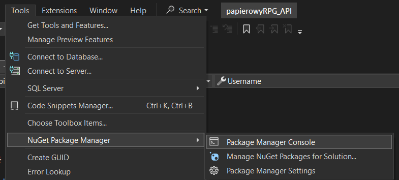

# Development

## Struktura projektu

Aktualnie struktura wygląda niepotrzebnie skomplikowanie,
jednak w czasie każdy moduł (folder) będzie odpowiedzialny
za inną część logiki aplikacji.

### Models

Tutaj znajdują się modele danych, które będą znajdowały się
w bazie danych. Model to klasa złożona z samych pól
publicznych. Typ pola przekłada się na typ kolumny w DB.

### Database

Moduł zawiera konteksty EntityFrameworkCore. Każdy kontekst
musi dziedziczyć po klasie `DbContext`. W kontesktach "rejestrujemy" modele przez dodanie pola publicznego typu
`DbSet<Model>`. Kontekst łączy się z bazą danych w metodzie
`OnConfiguring` lub w konstruktorze.

### Services

Serwis to klasa, która zawiera logikę działania na bazie
danych, poprzez konteksty. Najlepiej (moim zdaniem), żeby każdy model posiadał swój serwis. Tutaj pojawią się też ewentualne walidacje modeli itp.

### Controllers

Kontrolery to klasy obsługujące poszczególne endpointy API.
Wszystkie działania na bazie danych wykonują poprzez
serwisy. Kontrolery rejestrują się automatycznie.

## EntityFrameworkCore

EF Core to ORM do baz danych pozwalający na łatwiejsze
operacje, bez potrzeby ręcznego pisania zapytań SQL.

### Migracje

Jeśli modele/konteksty zostaną zmienione i/lub zostaną
dodane nowe modele będzie musiała zostać wykonana migracja.
Bez migracji będą pojawiały się błędy typu `no such table`
lub `no field`. Aby wykonać migrację trzeba:

- pobrać za pomocą NuGet paczkę `EntityFrameworkCore.Tools`
- Otworzyć konsolę menadżera paczek

- wpisać komendę `Add-Migration <Nazwa migracji>`, aby dodać
migrację (plik opisujący zmiany w modelach i kontekstach)
- następnie `Update-Database`, aby zaaplikować migracje
i zupdate'ować bazę danych
